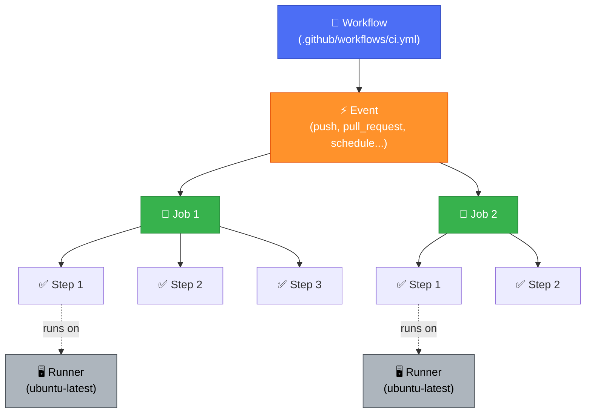
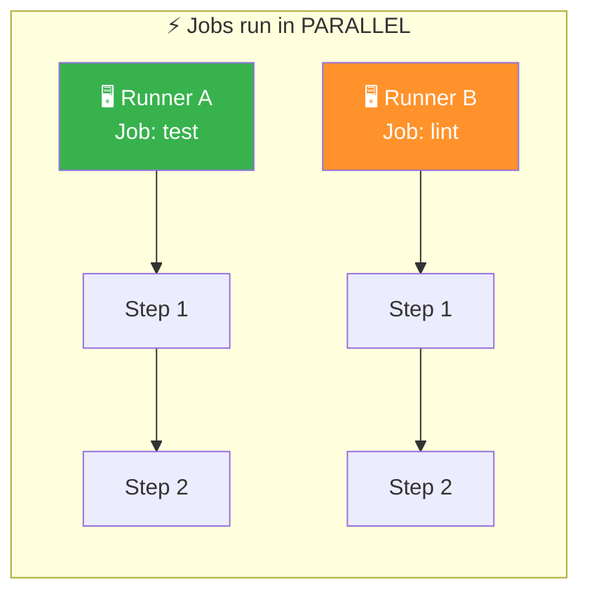
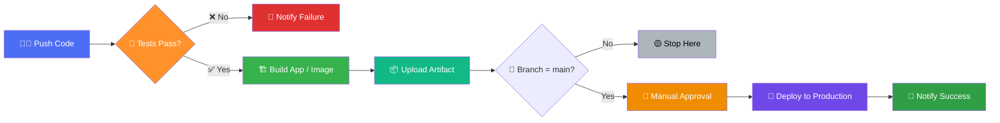
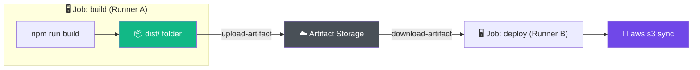

# 🚀 GitHub Actions — The Complete Practical Guide


> **Automate everything: build, test, deploy, and manage your software — right from your GitHub repository.**

---

## 📖 Table of Contents

1. [What is GitHub Actions?](#what-is-github-actions)
2. [Why It Matters](#why-it-matters)
3. [Core Concepts](#core-concepts)
4. [Anatomy of a Workflow File](#anatomy-of-a-workflow-file)
5. [Events — What Triggers a Workflow](#events--what-triggers-a-workflow)
6. [Runners — Where Your Code Actually Runs](#runners--where-your-code-actually-runs)
7. [Jobs, Steps & Actions Explained](#jobs-steps--actions-explained)
8. [Using Secrets Safely](#using-secrets-safely)
9. [Environment Variables & Contexts](#environment-variables--contexts)
10. [Real Example 1: CI Pipeline for a Node.js App](#real-example-1-ci-pipeline-for-a-nodejs-app)
11. [Real Example 2: Python Testing with Matrix Builds](#real-example-2-python-testing-with-matrix-builds)
12. [Real Example 3: Build & Push a Docker Image](#real-example-3-build--push-a-docker-image)
13. [Real Example 4: Deploy to AWS (S3 + EC2)](#real-example-4-deploy-to-aws-s3--ec2)
14. [Real Example 5: Deploy to Kubernetes (EKS)](#real-example-5-deploy-to-kubernetes-eks)
15. [Conditional Execution & Job Dependencies](#conditional-execution--job-dependencies)
16. [Caching for Speed](#caching-for-speed)
17. [Artifacts — Passing Data Between Jobs](#artifacts--passing-data-between-jobs)
18. [Reusable Workflows & Composite Actions](#reusable-workflows--composite-actions)
19. [Environments & Manual Approvals](#environments--manual-approvals)
20. [Scheduled Workflows (Cron Jobs)](#scheduled-workflows-cron-jobs)
21. [Manual Trigger (workflow_dispatch)](#manual-trigger-workflow_dispatch)
22. [Security Best Practices](#security-best-practices)
23. [Debugging a Failing Workflow](#debugging-a-failing-workflow)
24. [Common Mistakes & How to Avoid Them](#common-mistakes--how-to-avoid-them)
25. [Cheat Sheet](#cheat-sheet)

---

## What is GitHub Actions?

**GitHub Actions** is GitHub's built-in automation and CI/CD (Continuous Integration / Continuous Delivery) platform. It lets you define **workflows** — automated sequences of steps — that run in response to events happening in your repository: a push, a pull request, a new release, an issue comment, or even a schedule like "every day at midnight."

Think of it as a robot that lives inside your GitHub repo. You tell it:

> "Whenever someone pushes code to `main`, run the tests. If they pass, build a Docker image and deploy it to production."

...and it just does that, every single time, without anyone manually running commands.

No external CI tool (Jenkins, CircleCI, Travis) is required — it's native to GitHub, version-controlled alongside your code, and free for public repositories (with generous free minutes for private ones too).

---

## Why It Matters

Before CI/CD tools like GitHub Actions, teams did this manually:

```
1. Developer writes code
2. Developer runs tests locally (or forgets to)
3. Developer manually SSHs into a server
4. Developer manually copies files and restarts the app
5. Something breaks in production 🔥
```

With GitHub Actions:

```
1. Developer pushes code
2. GitHub Actions automatically runs tests
3. If tests pass, it automatically builds the app
4. If build succeeds, it automatically deploys
5. Team gets a Slack/email notification either way
```

This removes human error, saves time, and enforces quality gates — nobody can merge broken code into `main` if a required check fails.

---

## Core Concepts

Before diving into code, you need five vocabulary words. Everything in GitHub Actions is built from these:

| Term | What it means | Real-world analogy |
|---|---|---|
| **Workflow** | An automated process made of one or more jobs, defined in a `.yml` file | A recipe |
| **Event** | The trigger that starts a workflow (push, PR, schedule, etc.) | The reason you start cooking |
| **Job** | A set of steps that run on the same runner (machine) | One dish in the recipe |
| **Step** | A single task — run a command or use a pre-built action | One instruction in the recipe |
| **Runner** | The virtual machine (or your own server) that executes the jobs | The kitchen and stove |
| **Action** | A reusable, packaged piece of automation (like a plugin) | A kitchen gadget someone already built for you |

Here's how these five pieces fit together, top to bottom:



> [!NOTE]
> An **Event** triggers a **Workflow**. A workflow contains one or more **Jobs**, which run on separate **Runners**. Each job runs its **Steps** one after another, in order.

Workflows live in a special folder in your repository:

```
your-repo/
└── .github/
    └── workflows/
        ├── ci.yml
        ├── deploy.yml
        └── nightly-tests.yml
```

Every `.yml` file in that folder is an independent workflow.

---

## Anatomy of a Workflow File

Here's the skeleton every workflow follows:

```yaml
name: My First Workflow          # Display name shown in the Actions tab

on: [push]                       # Event that triggers this workflow

jobs:                            # One or more jobs
  say-hello:                     # Job ID (you choose this name)
    runs-on: ubuntu-latest       # The machine this job runs on

    steps:                       # The list of tasks
      - name: Print a greeting
        run: echo "Hello, GitHub Actions!"
```

That's it. Commit this as `.github/workflows/hello.yml`, push it, and go to the **Actions** tab of your repo — you'll see it run automatically and print "Hello, GitHub Actions!" in the logs.

---

## Events — What Triggers a Workflow

The `on:` key defines what makes the workflow fire. Some common ones:

```yaml
on: push                          # Any push to any branch

on:
  push:
    branches: [main, develop]     # Only push to these branches

on:
  pull_request:
    branches: [main]              # Only PRs targeting main

on:
  push:
    tags: ['v*']                  # Only when a tag like v1.0.0 is pushed

on:
  schedule:
    - cron: '0 0 * * *'           # Every day at midnight UTC

on: workflow_dispatch             # Manual trigger via the "Run workflow" button

on:
  issues:
    types: [opened]               # When a new issue is created
```

You can combine multiple events:

```yaml
on:
  push:
    branches: [main]
  pull_request:
    branches: [main]
  workflow_dispatch:
```

---

## Runners — Where Your Code Actually Runs

A **runner** is the machine that executes your job's steps. GitHub provides free hosted runners:

```yaml
runs-on: ubuntu-latest     # Linux (most common, fastest to boot)
runs-on: windows-latest    # Windows
runs-on: macos-latest      # macOS (useful for iOS builds)
```

You can also run jobs on **your own infrastructure** (a "self-hosted runner") — useful when you need specific hardware, GPU access, or to deploy inside a private network without exposing it to the internet:

```yaml
runs-on: self-hosted
```

---

## Jobs, Steps & Actions Explained

A workflow can have **multiple jobs**, and by default they run **in parallel**:

```yaml
jobs:
  test:
    runs-on: ubuntu-latest
    steps:
      - run: echo "Running tests..."

  lint:
    runs-on: ubuntu-latest
    steps:
      - run: echo "Running linter..."
```

Both `test` and `lint` start at the same time, on separate machines, independent of each other.



**Steps** inside a job run **sequentially**, top to bottom, on the *same* machine — so they share files and state. A step is either:

- A **shell command**, using `run:`
- A **pre-built action**, using `uses:`

```yaml
steps:
  - name: Checkout the repository code
    uses: actions/checkout@v4        # A pre-built action from GitHub

  - name: Show current directory
    run: pwd                          # A raw shell command

  - name: Install dependencies
    run: npm install
```

`actions/checkout@v4` is the most-used action in the entire ecosystem — without it, your runner starts as an **empty machine** with no copy of your repo. It's almost always your first step.

You can also use actions built by the community, published to the [GitHub Marketplace](https://github.com/marketplace?type=actions) — for Slack notifications, AWS deployments, Docker builds, code quality scans, and thousands more.

---

## Using Secrets Safely

Never hardcode passwords, API keys, or tokens in your YAML file. Instead, store them in **GitHub Secrets**:

**Repo → Settings → Secrets and variables → Actions → New repository secret**

Then reference them like this:

```yaml
steps:
  - name: Deploy using API key
    env:
      API_KEY: ${{ secrets.MY_API_KEY }}
    run: ./deploy.sh
```

Secrets are encrypted at rest, masked in logs (GitHub auto-replaces their value with `***` if they accidentally get printed), and only accessible to workflows in that repository (or organization, if set at that level).

> [!WARNING]
> Never `echo` a secret directly, and never commit `.env` files containing real keys. Masking only hides *exact* known values — logging a transformed or partial secret can still leak it.

---

## Environment Variables & Contexts

GitHub Actions gives you a rich set of built-in variables through **contexts**:

```yaml
steps:
  - name: Show useful info
    run: |
      echo "Branch: ${{ github.ref_name }}"
      echo "Actor: ${{ github.actor }}"
      echo "Commit SHA: ${{ github.sha }}"
      echo "Event: ${{ github.event_name }}"
```

You can also define your own environment variables at the workflow, job, or step level:

```yaml
env:
  NODE_ENV: production        # Available to all jobs

jobs:
  build:
    env:
      BUILD_TYPE: release     # Available to all steps in this job
    steps:
      - name: Build
        env:
          DEBUG: false         # Available only to this step
        run: npm run build
```

---

## The Big Picture: A Typical CI/CD Pipeline

Before jumping into examples, here's what most production pipelines actually look like end to end — this is the shape every example below builds toward:



> [!TIP]
> Every real-world pipeline is a variation of this same shape: **test → build → package → (approve) → deploy → notify**. Once you can build this, you can build almost any CI/CD workflow.

---

## Real Example 1: CI Pipeline for a Node.js App

This runs on every push and pull request, installs dependencies, lints, and runs tests.

```yaml
name: Node.js CI

on:
  push:
    branches: [main]
  pull_request:
    branches: [main]

jobs:
  build-and-test:
    runs-on: ubuntu-latest

    strategy:
      matrix:
        node-version: [18.x, 20.x]

    steps:
      - name: Checkout code
        uses: actions/checkout@v4

      - name: Setup Node.js ${{ matrix.node-version }}
        uses: actions/setup-node@v4
        with:
          node-version: ${{ matrix.node-version }}
          cache: 'npm'

      - name: Install dependencies
        run: npm ci

      - name: Run linter
        run: npm run lint

      - name: Run tests
        run: npm test

      - name: Build project
        run: npm run build
```

This example runs the whole pipeline against **two Node.js versions** (18 and 20) automatically, in parallel — that's the `matrix` strategy, and it's how you verify compatibility across multiple versions without writing duplicate jobs.

---

## Real Example 2: Python Testing with Matrix Builds

```yaml
name: Python CI

on: [push, pull_request]

jobs:
  test:
    runs-on: ubuntu-latest
    strategy:
      matrix:
        python-version: ["3.9", "3.10", "3.11", "3.12"]

    steps:
      - uses: actions/checkout@v4

      - name: Set up Python ${{ matrix.python-version }}
        uses: actions/setup-python@v5
        with:
          python-version: ${{ matrix.python-version }}
          cache: 'pip'

      - name: Install dependencies
        run: |
          python -m pip install --upgrade pip
          pip install -r requirements.txt
          pip install pytest pytest-cov

      - name: Run tests with coverage
        run: pytest --cov=./ --cov-report=xml

      - name: Upload coverage report
        uses: actions/upload-artifact@v4
        with:
          name: coverage-report-${{ matrix.python-version }}
          path: coverage.xml
```

Four Python versions × one job definition = four parallel test runs. This catches version-specific bugs before they ever reach a user.

---

## Real Example 3: Build & Push a Docker Image

This builds a Docker image and pushes it to Docker Hub whenever code lands on `main`.

```yaml
name: Build and Push Docker Image

on:
  push:
    branches: [main]

jobs:
  docker:
    runs-on: ubuntu-latest
    steps:
      - name: Checkout code
        uses: actions/checkout@v4

      - name: Log in to Docker Hub
        uses: docker/login-action@v3
        with:
          username: ${{ secrets.DOCKERHUB_USERNAME }}
          password: ${{ secrets.DOCKERHUB_TOKEN }}

      - name: Set up Docker Buildx
        uses: docker/setup-buildx-action@v3

      - name: Build and push
        uses: docker/build-push-action@v5
        with:
          context: .
          push: true
          tags: |
            myusername/myapp:latest
            myusername/myapp:${{ github.sha }}
          cache-from: type=gha
          cache-to: type=gha,mode=max
```

Notice: every image gets **two tags** — `latest` and one tied to the exact commit SHA. This means you can always trace a running container back to the exact code that produced it — critical for debugging production incidents.

---

## Real Example 4: Deploy to AWS (S3 + EC2)

### Deploying a static site to S3

```yaml
name: Deploy Static Site to S3

on:
  push:
    branches: [main]

jobs:
  deploy:
    runs-on: ubuntu-latest
    steps:
      - uses: actions/checkout@v4

      - name: Configure AWS credentials
        uses: aws-actions/configure-aws-credentials@v4
        with:
          aws-access-key-id: ${{ secrets.AWS_ACCESS_KEY_ID }}
          aws-secret-access-key: ${{ secrets.AWS_SECRET_ACCESS_KEY }}
          aws-region: ap-south-1

      - name: Build site
        run: |
          npm ci
          npm run build

      - name: Sync to S3
        run: aws s3 sync ./dist s3://my-website-bucket --delete

      - name: Invalidate CloudFront cache
        run: |
          aws cloudfront create-invalidation \
            --distribution-id ${{ secrets.CLOUDFRONT_DISTRIBUTION_ID }} \
            --paths "/*"
```

### Deploying an app to an EC2 instance over SSH

```yaml
name: Deploy to EC2

on:
  push:
    branches: [main]

jobs:
  deploy:
    runs-on: ubuntu-latest
    steps:
      - name: Deploy via SSH
        uses: appleboy/ssh-action@v1.0.3
        with:
          host: ${{ secrets.EC2_HOST }}
          username: ubuntu
          key: ${{ secrets.EC2_SSH_KEY }}
          script: |
            cd /home/ubuntu/my-app
            git pull origin main
            docker compose down
            docker compose up -d --build
```

This example uses a *reusable community action* (`appleboy/ssh-action`) to SSH into a live EC2 box and redeploy — a real pattern used by thousands of small-to-mid-sized production teams.

---

## Real Example 5: Deploy to Kubernetes (EKS)

```yaml
name: Deploy to EKS

on:
  push:
    branches: [main]

jobs:
  deploy:
    runs-on: ubuntu-latest
    steps:
      - uses: actions/checkout@v4

      - name: Configure AWS credentials
        uses: aws-actions/configure-aws-credentials@v4
        with:
          aws-access-key-id: ${{ secrets.AWS_ACCESS_KEY_ID }}
          aws-secret-access-key: ${{ secrets.AWS_SECRET_ACCESS_KEY }}
          aws-region: ap-south-1

      - name: Update kubeconfig
        run: aws eks update-kubeconfig --name my-cluster --region ap-south-1

      - name: Deploy new image
        run: |
          kubectl set image deployment/my-app \
            my-app=myusername/myapp:${{ github.sha }} \
            --record
          kubectl rollout status deployment/my-app
```

Note the `kubectl rollout status` step — it makes the workflow **wait and fail** if the new pods don't come up healthy, instead of silently reporting success on a broken deploy.

---

## Conditional Execution & Job Dependencies

### Running a job only if another job succeeded

```yaml
jobs:
  test:
    runs-on: ubuntu-latest
    steps:
      - run: npm test

  deploy:
    needs: test              # Waits for 'test' to finish successfully
    runs-on: ubuntu-latest
    steps:
      - run: ./deploy.sh
```

### Running a step only under certain conditions

```yaml
steps:
  - name: Notify only on failure
    if: failure()
    run: ./notify-slack.sh "Build failed!"

  - name: Deploy only from main branch
    if: github.ref == 'refs/heads/main'
    run: ./deploy.sh

  - name: Skip on draft PRs
    if: github.event.pull_request.draft == false
    run: npm test
```

`if:` conditions are one of the most powerful tools in Actions — they let a single workflow behave differently for feature branches vs. `main`, drafts vs. ready PRs, and success vs. failure paths.

---

## Caching for Speed

Reinstalling dependencies from scratch on every run wastes minutes. Cache them:

```yaml
- name: Cache node modules
  uses: actions/cache@v4
  with:
    path: ~/.npm
    key: ${{ runner.os }}-npm-${{ hashFiles('**/package-lock.json') }}
    restore-keys: |
      ${{ runner.os }}-npm-
```

The `key` is a fingerprint of your lockfile — if the lockfile hasn't changed, GitHub restores the cached dependencies instantly instead of re-downloading everything. Many `setup-*` actions (like `setup-node`, `setup-python`) now support `cache:` as a built-in option, as shown in earlier examples — simpler than writing this manually.

---

## Artifacts — Passing Data Between Jobs

Each job runs on a **fresh, isolated machine** — so a build produced in one job isn't automatically visible in another. **Artifacts** solve this:



```yaml
jobs:
  build:
    runs-on: ubuntu-latest
    steps:
      - uses: actions/checkout@v4
      - run: npm ci && npm run build

      - name: Upload build output
        uses: actions/upload-artifact@v4
        with:
          name: dist-files
          path: dist/

  deploy:
    needs: build
    runs-on: ubuntu-latest
    steps:
      - name: Download build output
        uses: actions/download-artifact@v4
        with:
          name: dist-files
          path: dist/

      - name: Deploy
        run: aws s3 sync dist/ s3://my-bucket
```

This pattern — **build once, deploy in a separate job** — is standard practice. It keeps your deploy job lean (no need to reinstall build tools) and guarantees you deploy the *exact* artifact that was tested.

---

## Reusable Workflows & Composite Actions

When you find yourself copy-pasting the same YAML across five repos, stop — extract it.

### Reusable Workflow (callable from other workflows)

`.github/workflows/reusable-deploy.yml`:

```yaml
name: Reusable Deploy Workflow

on:
  workflow_call:
    inputs:
      environment:
        required: true
        type: string
    secrets:
      AWS_ACCESS_KEY_ID:
        required: true
      AWS_SECRET_ACCESS_KEY:
        required: true

jobs:
  deploy:
    runs-on: ubuntu-latest
    steps:
      - uses: actions/checkout@v4
      - name: Deploy to ${{ inputs.environment }}
        run: echo "Deploying to ${{ inputs.environment }}"
```

Calling it from another workflow:

```yaml
name: Trigger Deploy

on:
  push:
    branches: [main]

jobs:
  call-deploy:
    uses: ./.github/workflows/reusable-deploy.yml
    with:
      environment: production
    secrets:
      AWS_ACCESS_KEY_ID: ${{ secrets.AWS_ACCESS_KEY_ID }}
      AWS_SECRET_ACCESS_KEY: ${{ secrets.AWS_SECRET_ACCESS_KEY }}
```

### Composite Action (a bundle of steps, reused within one repo)

`.github/actions/setup-project/action.yml`:

```yaml
name: 'Setup Project'
description: 'Checkout code and install dependencies'

runs:
  using: "composite"
  steps:
    - uses: actions/checkout@v4
    - uses: actions/setup-node@v4
      with:
        node-version: '20'
    - run: npm ci
      shell: bash
```

Used like this:

```yaml
steps:
  - uses: ./.github/actions/setup-project
  - run: npm test
```

---

## Environments & Manual Approvals

For production deploys, you often want a **human to click approve** before anything happens. GitHub Environments give you this:

**Repo → Settings → Environments → New environment → "production" → Required reviewers**

```yaml
jobs:
  deploy-production:
    runs-on: ubuntu-latest
    environment:
      name: production
      url: https://myapp.com
    steps:
      - name: Deploy
        run: ./deploy.sh
```

Once this is configured, the workflow will **pause** at this job and wait for an approved reviewer to click "Approve and deploy" in the GitHub UI — a real safety gate used constantly in enterprise pipelines.

---

## Scheduled Workflows (Cron Jobs)

Run a workflow automatically on a timer — no push required:

```yaml
name: Nightly Database Backup

on:
  schedule:
    - cron: '0 2 * * *'   # Every day at 2:00 AM UTC

jobs:
  backup:
    runs-on: ubuntu-latest
    steps:
      - name: Run backup script
        run: ./scripts/backup-db.sh
```

Cron syntax: `minute hour day-of-month month day-of-week`. A few handy patterns:

| Cron | Meaning |
|---|---|
| `0 * * * *` | Every hour |
| `0 0 * * *` | Every day at midnight |
| `0 9 * * 1` | Every Monday at 9 AM |
| `*/15 * * * *` | Every 15 minutes |

---

## Manual Trigger (workflow_dispatch)

Sometimes you want a "Run" button instead of an automatic trigger — great for one-off deploys or maintenance tasks:

```yaml
name: Manual Deploy

on:
  workflow_dispatch:
    inputs:
      environment:
        description: 'Environment to deploy to'
        required: true
        default: 'staging'
        type: choice
        options:
          - staging
          - production

jobs:
  deploy:
    runs-on: ubuntu-latest
    steps:
      - name: Deploy
        run: echo "Deploying to ${{ github.event.inputs.environment }}"
```

This shows up as a **"Run workflow"** button in the Actions tab, with a dropdown to pick `staging` or `production` before it runs.

---

## Security Best Practices

> [!IMPORTANT]
> A misconfigured workflow can leak secrets or grant attackers write access to your repo. Treat your `.github/workflows/` folder with the same care as production code.

1. **Never hardcode secrets** — always use `secrets.*`, never paste API keys into YAML.
2. **Pin third-party actions to a full commit SHA**, not just a tag, for anything security-sensitive:
   ```yaml
   uses: actions/checkout@8ade135a41bc03ea155e62e844d188df1ea18608  # v4.1.1
   ```
   Tags can be moved by the action's author; a SHA cannot.
3. **Use the principle of least privilege** for the built-in `GITHUB_TOKEN`:
   ```yaml
   permissions:
     contents: read
     pull-requests: write
   ```
4. **Never trigger sensitive workflows on `pull_request_target` carelessly** — it runs with access to your secrets even for forked-repo PRs, which is a classic supply-chain attack vector.
5. **Review third-party actions before using them** — treat them like any other dependency; check the source, star count, and maintenance activity.
6. **Use OpenID Connect (OIDC) instead of long-lived AWS keys** where possible:
   ```yaml
   permissions:
     id-token: write
     contents: read
   steps:
     - uses: aws-actions/configure-aws-credentials@v4
       with:
         role-to-assume: arn:aws:iam::123456789012:role/github-actions-role
         aws-region: ap-south-1
   ```
   This avoids storing AWS access keys as secrets entirely — GitHub issues a short-lived token instead.
7. **Restrict which branches can trigger deploy workflows** to prevent accidental production pushes from feature branches.

---

## Debugging a Failing Workflow

- Click into the failed run in the **Actions** tab — each step is expandable with full logs.
- Enable verbose debug logging by setting these repository secrets:
  ```
  ACTIONS_STEP_DEBUG = true
  ACTIONS_RUNNER_DEBUG = true
  ```
- Add a manual debug step to print context when something's unclear:
  ```yaml
  - name: Dump context
    run: echo '${{ toJson(github) }}'
  ```
- Use `continue-on-error: true` on a step temporarily while investigating, so the rest of the job still runs:
  ```yaml
  - name: Flaky step
    continue-on-error: true
    run: ./sometimes-fails.sh
  ```
- Re-run individual failed jobs using the **"Re-run failed jobs"** button instead of the whole workflow.

---

## Common Mistakes & How to Avoid Them

| Mistake | Fix |
|---|---|
| Forgetting `actions/checkout` | Your job starts on an empty machine — always checkout first |
| Hardcoding secrets in YAML | Use `secrets.*` context instead |
| Assuming jobs share files | Jobs are isolated — use `artifacts` to pass data between them |
| Using `pull_request_target` with untrusted code checkout | Never checkout and run code from a fork in this event without extreme care |
| Not pinning action versions | Use `@v4` at minimum, or a SHA for critical workflows |
| One giant job doing everything | Split into `build`, `test`, `deploy` — parallelize what doesn't depend on each other |
| No `needs:` between dependent jobs | Jobs run in parallel by default — declare dependencies explicitly |

---

## Cheat Sheet

```yaml
# Trigger on push to main
on:
  push:
    branches: [main]

# Trigger on PR
on:
  pull_request:

# Manual trigger
on:
  workflow_dispatch:

# Scheduled trigger
on:
  schedule:
    - cron: '0 0 * * *'

# Run on a specific OS
runs-on: ubuntu-latest

# Checkout code (almost always step 1)
- uses: actions/checkout@v4

# Set an environment variable
env:
  KEY: value

# Use a secret
${{ secrets.MY_SECRET }}

# Conditional step
if: github.ref == 'refs/heads/main'

# Job dependency
needs: previous-job-name

# Matrix build
strategy:
  matrix:
    version: [1, 2, 3]

# Upload/download artifacts
uses: actions/upload-artifact@v4
uses: actions/download-artifact@v4
```

---

### 🎯 The Core Idea, In One Sentence

> **GitHub Actions turns your repository's events into automated pipelines — write the trigger, define the steps, and let GitHub run them on a fresh machine every single time, reliably and repeatably.**

Once this clicks, everything else — CI, CD, scheduled jobs, approvals, multi-environment deploys — is just combinations of the same five building blocks: **workflow, event, job, step, runner.**
